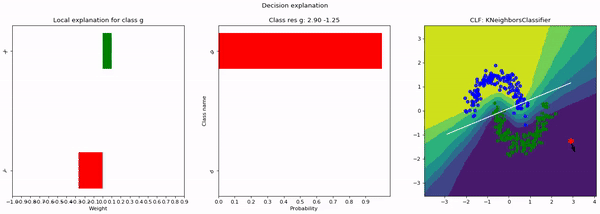

# LIME-decision-boundary-notebook

LIME provides local interpretable model-agnostic explanations.  
This Colab notebook explains and visualizes the decision boundaries produced by LIME.  

[View it in Colab](https://colab.research.google.com/drive/174iZ04YqN0l6j98oS2A_HF4E4bUE7QBh#scrollTo=aNr7Qbcw6Lkp)

[Check out the original LIME project](https://github.com/marcotcr/lime)
